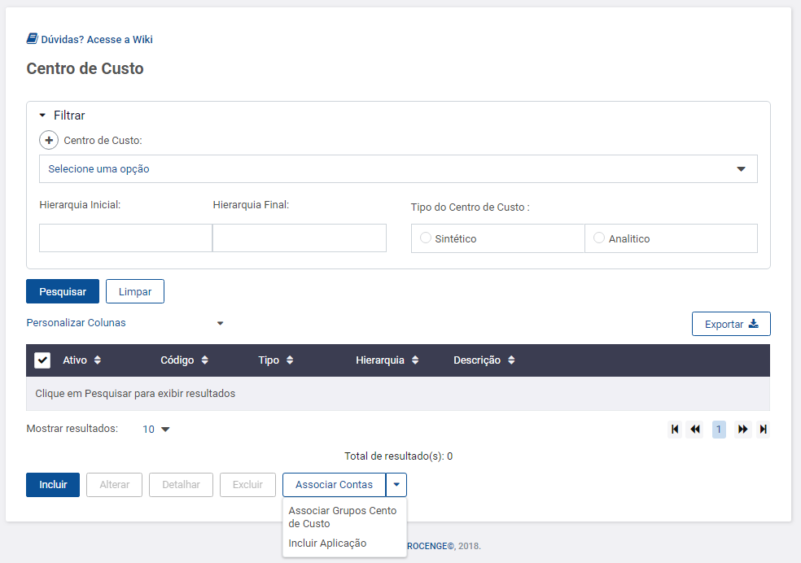

# Buttonsplit



Componente aguardando documentação.

* [x] Componente definido e documentado pelos designers
* [x] Componente criado no backlog dos arquitetos
* [x] Componente priorizado na "sprint" dos arquitetos
* [x] Componente desenvolvido


| nome Parâmetro | Input/Output | tipo    | descrição |
| -------------- | ------------ | ------- | --------- |
| itensBotoes    | **Input**    | string  |           |
| classeBotao    | **Input**    | string  |           |
| empresa        | **Input**    | string  |           |
| direitoperfil  | **Input**    | string  |           |
| desabilitar    | **Input**    | boolean |           |

## Componente

Só deverá ser utilizado para devera expressar a **função que não dependem de ação na tabela** da tela. Poderá ser utilizado sem limites nas telas.



.png>)







```markup
<div class="row">
  <div class="col-lg-12 box-btns">
    <procenge-button 
      classeBotao="primarioVerde"
      (clique)="salvar()"
      tipo="salvar">
    </procenge-button>
  </div>
</div>
```



```javascript
Não é necessário código JavaScript para implementar este componente.
```



```css
Não é necessário código CSS para implementar este componente.
```


