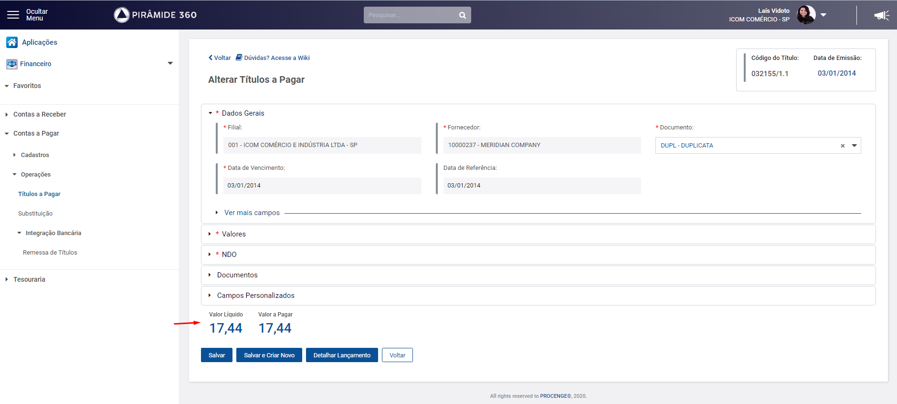

# Campos totalizadores


**Status: Componente aguardando desenvolvimento.**

* [x] Componente definido e documentado pelos designers
* [x] Componente criado no backlog dos arquitetos
* [x] Componente priorizado na "sprint" dos arquitetos
* [x] Componente desenvolvido



O campo totalizador deve ser utilizado para informar dados referentes a valor e data.


## Componente

### Estados

#### Valor normal

.png>)

#### Valor positivo

.png>)

#### Valor negativo

.png>)

#### Data

.png>)

## Exemplo de uso

Para utilizar este componente o desenvolvedor deve utilizar esta construção. Passando as variáveis de valor.







```markup
<div class="row box-total">
  <div class="espacamentoValores">
    <h6>Valor Líquido</h6>
    <h3>
      <span class="label label-default" [ngStyle]="{'color':ValorLiquido >= 0 ? '#0a5096' : '#973937' }">
        {{ ValorLiquido | number:'1.2' }}
      </span>
    </h3>
  </div>

  <div class="espacamentoValores">
    <h6>Valor Devido</h6>
     <h3>
      <span class="label label-default" [ngStyle]="{'color':ValorLiquido >= 0 ? '#0a5096' : '#973937' }">
        {{ ValorDevido | number:'1.2' }}
      </span>
    </h3>
  </div>
</div>
```



```
```



```
```




&#x20;Totalizador **com** moeda visível




.png>)



```markup
 <div class="row box-total">
  <div class="espacamentoValores">
    <h6>Valor Líquido</h6>
    <h3>
      <span class="label label-default" [ngStyle]="{'color':ValorLiquido >= 0 ? '#0a5096' : '#973937' }">
        {{ ValorLiquido | currency:'BRL': 'symbol' }}
      </span>
    </h3>
  </div>

  <div class="espacamentoValores">
    <h6>Valor Devido</h6>
     <h3>
      <span class="label label-default" [ngStyle]="{'color':ValorLiquido >= 0 ? '#0a5096' : '#973937' }">
        {{ ValorDevido | currency:'BRL': 'symbol' }}
      </span>
    </h3>
  </div>
</div>
 
 | number:'1.2'
```










