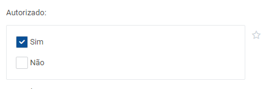

# Checkbox


Componente aguardando documentação.

* [x] Componente definido e documentado pelos designers
* [x] Componente criado no backlog dos arquitetos
* [x] Componente priorizado na "sprint" dos arquitetos
* [x] Componente desenvolvido


| nome parâmetro     | Input/Output | tipo    | descrição |
| ------------------ | ------------ | ------- | --------- |
| nome               | **Input**    | string  |           |
| opcoes             | **Input**    | array   |           |
| selecao            | **Input**    | array   |           |
| desabilitar        | **Input**    | boolean |           |
| direitoperfil      | **Input**    | string  |           |
| tamanho            | **Input**    | string  |           |
| empresa            | **Input**    | string  |           |
| clique             | **Output**   |         |           |
| opcoesSelecionadas | **Output**   |         |           |







```markup
<div id="indAutorizado" class="col-lg-4 col-md-6 col-sm-12 box-comp comp-favorito">      
  <div class="box-label">
    <label class="legenda">
      Autorizado:
    </label>
  </div>    
  <div class="espacoComponenteDoBotaoFavorito">
    <div class="box-container">
      <procenge-checkbox
        [(opcoes)]="listaIndAutorizado"
        [selecao]="selecaoIndAutorizado"
        (opcoesSelecionadas)="selecionarIndAutorizado($event); aplicar('indAutorizado')">
      </procenge-checkbox>
    </div>
  </div>          
</div>
```












checkbox  desabilitado








```markup
<div id="indAutorizadoJuros" class="col-lg-4 col-md-6 col-sm-12 box-comp comp-favorito">    
  <div class="box-label">
     <label class="legenda">
       Autorizado Juros:
     </label>
  </div>      
  <div class="espacoComponenteDoBotaoFavorito">
    <div class="box-container">
      <procenge-checkbox              
        [(opcoes)]="listaIndAutorizadoJuros"
        [selecao]="selecaoIndAutorizadoJuros"
        (opcoesSelecionadas)="selecionarIndAutorizadoJuros($event)"
        [desabilitar]="indDesabilitarIndAutorizadoJuros">
      </procenge-checkbox>
    </div>
  </div>          
</div>
```










