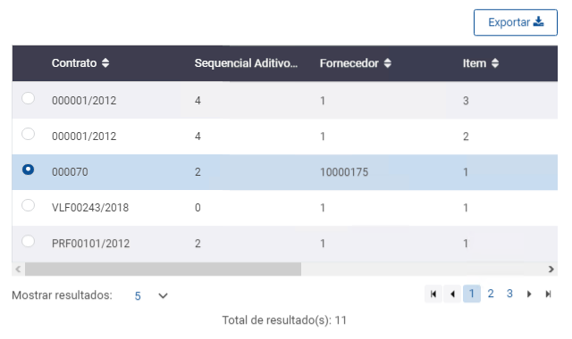

# Datatable

| Nome Parâmetro           | Obrigatório | Input/Output | Tipo    | Resultado Esperado                                                                     |
| ------------------------ | ----------- | ------------ | ------- | -------------------------------------------------------------------------------------- |
| codigoCadastro           | sim         | Input        | string  | o código diz ao banco de dados que ele pertence (qual a regra de negocio ela pertence) |
| id                       | sim         | Input        | string  | identificador único da tabela(tem que usar o padrão **dt-**descricaoCurta)             |
| esconderBotoesPesquisa   | não         | Input        | boolean | mostrar botão de pesquisa                                                              |
| dados                    | sim         | Input        | array   | dados que devem ser mostrados na tabela                                                |
| qtdLinhas                | não         | Input        | number  | especifica a quantidade de linhas da tabela                                            |
| colunas                  | sim         | Input        | array   | nomes das colunas da tabela                                                            |
| dadosSelecionados        | não         | Input        | array   | diz quais os dados que o usuário selecionou                                            |
| classeTable              | não         | Input        | string  |                                                                                        |
| carregando               | não         | Input        | boolean | mostrar load de carregamento de dados                                                  |
| tipo                     | não         | Input        | string  | PESQUISAR, ADICIONAR, VISUALIZAR                                                       |
| nomeDoItem               | não         | Input        | string  |                                                                                        |
| desabilitar              | não         | Input        | boolean |                                                                                        |
| colunasTotalizador       | não         | Input        | array   | nome das colunas do totalizador da tabela                                              |
| mostrarTotalizador       | não         | Input        | boolean | visualizar o totalizador(decimal) por coluna da tabela                                 |
| mostrarCheckboxes        | não         | Input        | boolean | mostrar checkbox de cada item da tabela                                                |
| mostrarBotaoDetalhar     | não         | Input        | boolean | mostrar botão de detalhamento dos dados da tabela                                      |
| campoConsultaGeral       | não         | Input        | boolean | parâmetro de caixa de pesquisa, para o datatable                                       |
| mostraRadioButton        | não         | Input        | boolean | mostrar tipo de escolha unica para tabela                                              |
| desabilitarBotaoPesquisa | não         | Input        | boolean | caixa de pesquisa para dados na tabela                                                 |
| valor                    |             | Output       |         |                                                                                        |
| ordenarColunas           | não         | Output       |         |                                                                                        |
| cliquelinha              | não         | Output       |         |                                                                                        |
| pesquisar                | não         | Output       |         |                                                                                        |
| limpar                   | não         | Output       |         | evento de click de limpeza de dados no filtro e na tabela                              |
| aoAdicionarItem          | não         | Output       |         |                                                                                        |
| aoAlterarItem            | não         | Output       |         |                                                                                        |
| aoDetalharItem           | não         | Output       |         | evento de click de detalhamento da linha clicada                                       |
| aoExcluirItem            | não         | Output       |         | evento de click de exclusão da linha clicada                                           |
| cliqueCheckbox           | não         | Output       |         |                                                                                        |
| cliqueRadioButton        | não         | Output       |         | opção de escolha de apenas 1 registro                                                  |

## Personalizar Colunas


**Todas as tabelas** devem conter a opção de **personalizar colunas.**



Os campos da tabela que possuírem **Código** deverão apresentar uma **coluna** para **código** e outra para a sua **descrição**.( Ex.: **"Código Empresa"** , **"Empresa"**)


.png>)

## Totalizador


O **totalizador** deve ser **personalizável** através do dropdown **"Personalizar Totalizadores:".**


.png>)

## RadioButton


**Status: Componente aguardando desenvolvimento.**

* [x] Componente definido e documentado pelos designers
* [x] Componente criado no backlog dos arquitetos
* [x] Componente priorizado na "sprint" dos arquitetos
* [x] Componente desenvolvido



Utilizar radio button quando for possível selecionar **apenas um registro**


## Para consulta


Utilizar para **consulta** de dados. Acompanhando a tabela, sempre terão os botões: **Incluir, Alterar, Detalhar, Excluir, Copiar.** A depender da tela haverão outros botões.


.png>)

## **Para adicionar/alterar/detalhar**


O Datatable também é utilizado nos cadastros, chamando o **sidebar** para que o usuário **adicione os dados.**


.png>)
