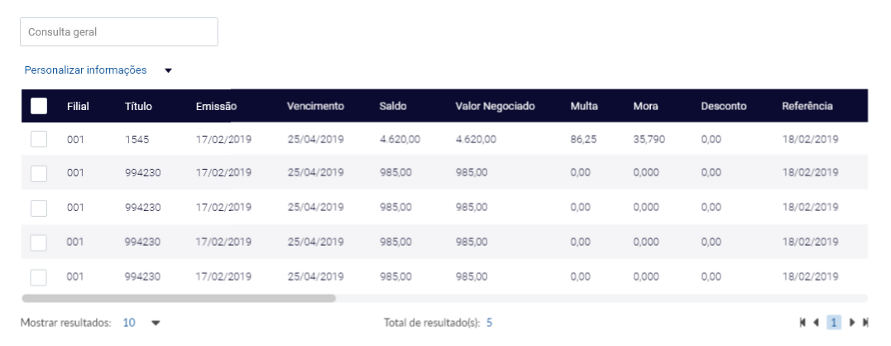
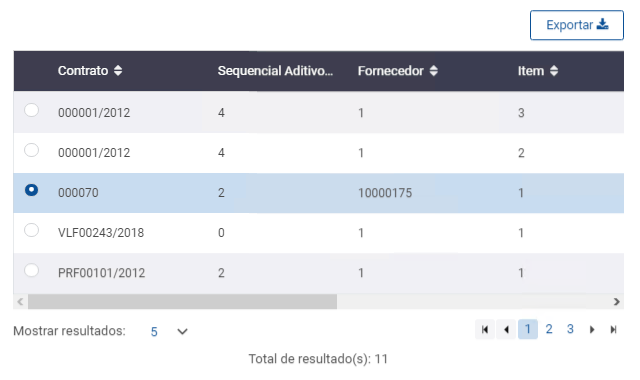

# Parâmetros e Exemplos


Campo de Consulta Geral acima do Datatable

**\[campoConsultaGeral]="true"**








```markup
<div class="row">
    <div  class="col-lg-12">
        <procenge-datatable 
            id="dt-descricaoUnica"
            [colunas]="colunas"
            [dados]="dados"
            [tipo]="'consultar'"
            [desabilitar]="tipoOperacao == 'detalharitem'"
            (valor)="dadosSelecionadosContratoTerc=$event"
            (limpar)="limpar()"
            [(dadosSelecionados)]="dadosSelecionadosContratoTerc"
            esconderBotoesPesquisa="true"
            [campoConsultaGeral]="true"
            [codigoCadastro]="codigoParaTabela">
        </procenge-datatable>
    </div>
</div>
```



```javascript
import { Cadastro } from './../../../shared/sistema/enum/cadastro';

// Exemplo de codigoParaTabela, 
// os codigos tem que estarem cadastrados nesse arquivo de cadastro
codigoParaTabela: string = Cadastro.CADASTRO_DE_TITULOS_A_RECEBER;

// exemplos de declaração
colunas: any[] = [];
dados: any[] = [];
dadosSelecionados: any[] = [];

// exemplo de como setar dados na lista
this.colunas = [
  { header: 'TITULO_NDO', field: 'titulo', tamanho: 100 },   
  { header: 'NDO', field: 'ndo', tamanho: 150 }
];

 dados.push({
  'ndo':ndo.NDO,          
  'titulo':titulo.TITULO_NDO
});
```



```
// não necessario
```




Selecionar apenas 1 opção

**`[mostraRadioButton]="true"`**








```markup
<div class="row">
    <div class="col-lg-12">
        <procenge-datatable 
            id="dt-descricaoUnica"
            [colunas]="colunas"
            [dados]="dados"
            [tipo]="'consultar'"  
            (valor)="dadosSelecionados=($event)"
            [(dadosSelecionados)]="dadosSelecionados"
            [campoConsultaGeral]="true"
            [mostraRadioButton]="true"
            [codigoCadastro]="codigoParaTabela">
        </procenge-datatable>
    </div>
</div>
```



```javascript
import { Cadastro } from './../../../shared/sistema/enum/cadastro';

// Exemplo de codigoParaTabela, 
// os codigos tem que estarem cadastrados nesse arquivo de cadastro
codigoParaTabela: string = Cadastro.CADASTRO_DE_TITULOS_A_RECEBER;

// exemplos de declaração
colunas: any[] = [];
dados: any[] = [];
dadosSelecionados: any[] = [];

// exemplo de como setar dados na lista
this.colunas = [
  { header: 'TITULO_NDO', field: 'titulo', tamanho: 100 },   
  { header: 'NDO', field: 'ndo', tamanho: 150 }
];

 dados.push({
  'ndo':ndo.NDO,          
  'titulo':titulo.TITULO_NDO
});
```



```
```




Desabilitar botão de pesquisa, e habilita-lo dependendo da regra de negocio

**\[desabilitarBotãoPesquisa]="desabilitarBotãoPesquisa"**








```markup
<div class="row">
  <div class="col-lg-12">
      <procenge-datatable
        id="dt-descricaoUnica"
        [colunas]="colunas"
        [dados]="dados"
        [(dadosSelecionados)]="dadosSelecionados"
        (valor)="dadosSelecionados=$event;"
        (pesquisar)="pesquisar($event)"
        [desabilitarBotaoPesquisa]="desabilitarBotaoPesquisa"
        (limpar)="limpar()" 
        (cliquelinha)="cliqueLinha($event)"
        [codigoCadastro]="codigoParaTabela">
      </procenge-datatable>
  </div>
</div>
```



```javascript
 import { Cadastro } from './../../../shared/sistema/enum/cadastro';

// Exemplo de codigoParaTabela, 
// os codigos tem que estarem cadastrados nesse arquivo de cadastro
codigoParaTabela: string = Cadastro.CADASTRO_DE_TITULOS_A_RECEBER;

// exemplos de declaração
colunas: any[] = [];
dados: any[] = [];
dadosSelecionados: any[] = [];

// exemplo de como setar dados na lista
this.colunas = [
  { header: 'TITULO_NDO', field: 'titulo', tamanho: 100 },   
  { header: 'NDO', field: 'ndo', tamanho: 150 }
];

 dados.push({
  'ndo':ndo.NDO,          
  'titulo':titulo.TITULO_NDO
});

 // inicia o botão desabilitado
 desabilitarBotaoPesquisa: boolean =true;
 
 // muda para botão habilitado
 this.desabilitarBotaoPesquisa=false;
```



```css
```




Tabela **mostrando** o totalizador








```markup
<div class="row">
  <div class="col-lg-12">
      <procenge-datatable
        id="dt-descricaoUnica"
        [colunas]="colunas"
        [dados]="dados"
        [(dadosSelecionados)]="dadosSelecionados"
        (valor)="dadosSelecionados=$event;"
        (pesquisar)="pesquisar($event)" 
        (limpar)="limpar()"  
        [codigoCadastro]="codigoParaTabela">
      </procenge-datatable>
  </div>
</div>
```



```javascript
import { Cadastro } from './../../../shared/sistema/enum/cadastro';

// Exemplo de codigoParaTabela, 
// os codigos tem que estarem cadastrados nesse arquivo de cadastro
codigoParaTabela: string = Cadastro.CADASTRO_DE_TITULOS_A_RECEBER;

// exemplos de declaração
colunas: any[] = [];
dados: any[] = [];
dadosSelecionados: any[] = [];

// exemplo de como setar dados na lista
this.colunas = [
  { header: 'TITULO_NDO', field: 'titulo', tamanho: 100 },   
  { header: 'NDO', field: 'ndo', tamanho: 150 }
];

 dados.push({
  'ndo':ndo.NDO,          
  'titulo':titulo.TITULO_NDO
});
```








Tabela **sem mostrar** o totalizador

**\[mostrarTotalizador]="false"**








```markup
<div class="row">
  <div class="col-lg-12">
      <procenge-datatable
        id="dt-descricaoUnica"
        [colunas]="colunas"
        [dados]="dados" 
        (valor)="dadosSelecionados=$event;"
        (pesquisar)="pesquisar($event)" 
        (limpar)="limpar()"  
        [mostrarTotalizador]="false" 
        [codigoCadastro]="codigoParaTabela">
      </procenge-datatable>
  </div>
</div>
```





```javascript
import { Cadastro } from './../../../shared/sistema/enum/cadastro';

// Exemplo de codigoParaTabela, 
// os codigos tem que estarem cadastrados nesse arquivo de cadastro
codigoParaTabela: string = Cadastro.CADASTRO_DE_TITULOS_A_RECEBER;

// exemplos de declaração
colunas: any[] = [];
dados: any[] = [];
dadosSelecionados: any[] = [];

// exemplo de como setar dados na lista
this.colunas = [
  { header: 'TITULO_NDO', field: 'titulo', tamanho: 100 },   
  { header: 'NDO', field: 'ndo', tamanho: 150 }
];

 dados.push({
  'ndo':ndo.NDO,          
  'titulo':titulo.TITULO_NDO
});
```






