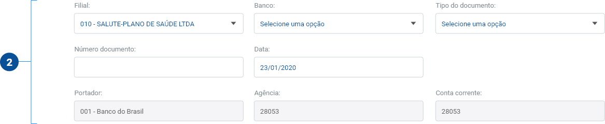
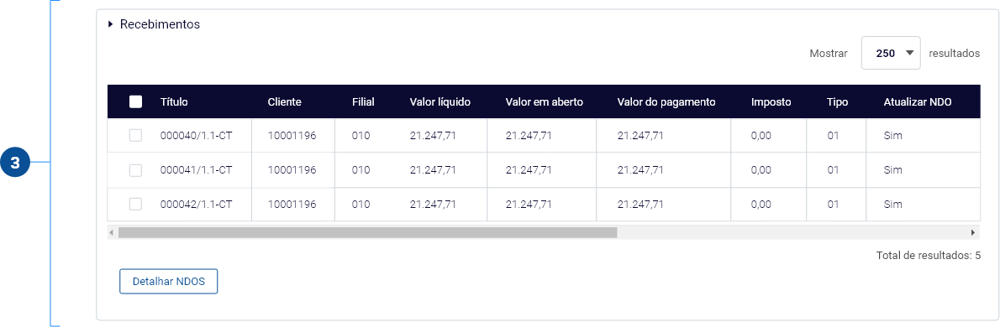
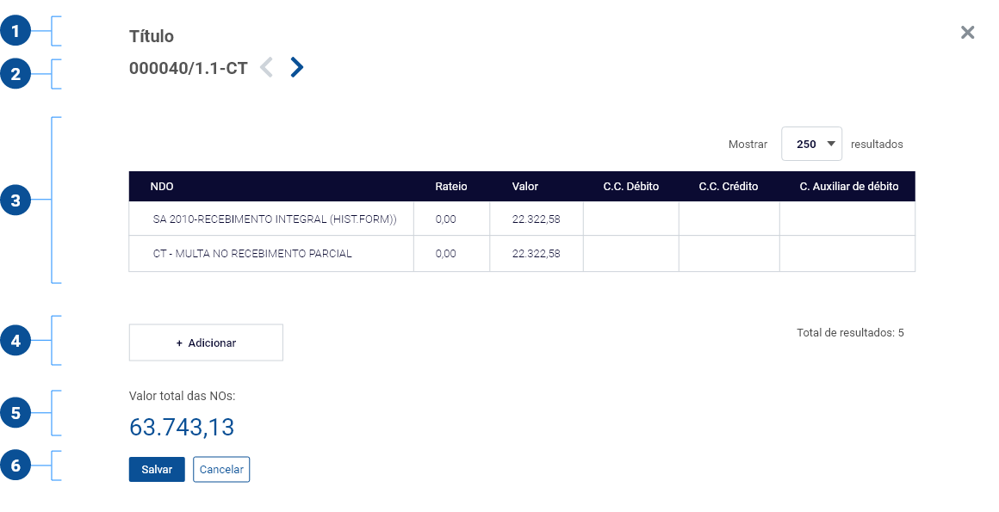
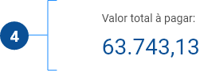

# Baixa massiva de títulos a receber

## Objetivo da tela

Dar baixa em vários títulos simultaneamente.

## Documentação

**Documentação para Desenvolvimento (Zeplin)**\
[https://zpl.io/2EplpgY](https://zpl.io/2EplpgY)

**Protótipo navegável (Adobe XD)**\
[https://xd.adobe.com/spec/8da2be05-6adb-4530-5811-d00ccc8f82b6-fb93/](https://xd.adobe.com/view/c48533cf-6084-46ab-6a35-614a3c764fe3-b2b4/screen/e83dfed5-7dde-42fd-9801-62ca826bd9b4/Financeiro-Baixa-de-t-tulos-a-receber-Baixa-massiv)

## Anatomia

A tela de Baixa Massiva de Títulos é construída por 5 elementos principais:

1. **Cabeçalho (Header)**
2. **Campos a serem alterados**
3. **Títulos alterados (TableEdit)**

### 1. Cabeçalho (Header)

O cabeçalho tem o objetivo de informar o usuário sobre qual a tela atual e permitir que ele retorne para a tela anterior.

### 2. Campos a serem alterados

O conteúdo desta composição tem o objetivo de permitir que o usuário informe os dados que ele quer atualizar em todos os títulos.

**1. Campos**\
****Os campos preenchidos terão seus dados replicados em todos os títulos previamente selecionados.

### 3. Recebimentos (TableEdit)

O objetivo do Accordion [TableEdit](https://procenge.gitbook.io/piramide-360-design-system/tabelas/tableedit) é mostrar ao usuário os títulos a receber de acordo com o filtro utilizado.

**3.1. Botão de ação - Detalhar NOS (Dialog)**\
Abre o componente Dialog e exibe as NDOS dos títulos selecionados anteriormente. É composto por 6 partes, são elas:

1. Header
2. Número do título
3. TableEdit com as NOS relacionadas ao titulo
4. Botão de ação que adiciona uma nova linha de registro na TableEdit
5. Totalizador exibindo o valor total das NDOS
6. Botões de ação Salvar e Cancelar

### 4. Totalizador

Exibe valor total dos títulos filtrados.

